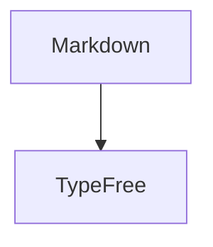

# TypeFree

[中文](./README.md) | English | [日本語](./README.ja.md)

<p align="center">
  
</p>

<p align="center">
  <strong>Open. Free. Yours.</strong>
</p>

TypeFree is an open, free, local-first Markdown editor. It keeps plain Markdown as the only source of truth while providing a block-level editing experience close to WYSIWYG: you can edit paragraphs, headings, quotes, code, formulas, and diagrams as rendered content, then switch back to the full source whenever you need it.

TypeFree does not try to hide Markdown. Your documents remain local files, the format stays transparent, and every file can still be opened by standard Markdown tools. The editor simply makes Markdown more natural and less noisy to write.

## Philosophy

- **Open**: source code is open, the document format is open, and files are not locked into a private database.
- **Free**: designed for free writing, modification, and distribution without a cloud account.
- **Yours**: Markdown belongs to you; TypeFree only helps you edit it more comfortably.

## Features

- **Block-level WYSIWYG editing**: click any Markdown block to edit its source, then return to the rendered view on blur.
- **Full source mode**: switch to the complete Markdown source while preserving editing position between source and WYSIWYG modes.
- **Local file workflow**: create, open, save, save as, rename, and receive unsaved-change warnings before closing.
- **Desktop experience**: powered by Tauri with system menus, recent files, native dialogs, close confirmation, and app icons.
- **Math**: inline and block LaTeX previews.
- **Mermaid diagrams**: diagram block preview with light and dark theme support.
- **Code blocks**: syntax highlighting, line numbers, language labels, and fenced-code language completion.
- **Editing helpers**: auto pairing for brackets, quotes, and Markdown markers; selection wrapping; paired deletion; IME composition protection.
- **Multilingual UI**: Chinese, English, and Japanese interface strings.
- **Themes and preferences**: light, dark, system theme, enter behavior, and paragraph transition settings.

## Who It Is For

TypeFree is for users who want Markdown to stay transparent but do not want to stare at raw text noise all day:

- Technical notes, developer documentation, READMEs, and blog drafts.
- Documents with code blocks, math formulas, or Mermaid diagrams.
- Local-first workflows with portable files and open tooling.
- A Typora-like experience that is lighter, more open, and easier to modify.

## Stack

- **React** for editor UI and interaction state.
- **Vite** for Web builds and development.
- **Tauri** for desktop windows, system menus, local file capabilities, and macOS packaging.
- **marked** for Markdown parsing and render extensions.
- **highlight.js** for code highlighting.
- **Mermaid** for diagrams.
- **KaTeX** for LaTeX math rendering.
- **pnpm workspace** for root scripts and frontend package management.

## Quick Start

### Requirements

- Node.js 18 or newer.
- pnpm.
- Rust stable toolchain.
- Xcode Command Line Tools for macOS desktop packaging.

### Install Dependencies

```bash
pnpm install
```

The repository root is the `pnpm workspace` entry and installs the Web and Tauri frontend dependencies under `frontend/`.

### Start Web Development

```bash
pnpm run dev
```

Default local URL:

```text
http://localhost:5173
```

### Start Desktop Development

```bash
pnpm run dev:desktop
```

This starts the Vite development server through Tauri and opens the desktop window.

### Build Web

```bash
pnpm run build
```

Build output:

```text
frontend/dist/
```

### Package Desktop

```bash
pnpm run dist:desktop
```

Tauri writes packages to:

```text
frontend/src-tauri/target/release/bundle/
```

The current macOS configuration generates `.app` and `.dmg` targets.

## Scripts

| Command | Description |
| --- | --- |
| `pnpm run dev` | Start the Web development server from the repository root |
| `pnpm run dev:web` | Explicit Web development mode |
| `pnpm run dev:desktop` | Start Tauri desktop development mode |
| `pnpm run build` | Build the Web version |
| `pnpm run build:web` | Explicit Web build mode |
| `pnpm run typecheck` | Run type checks |
| `pnpm run dist:desktop` | Build and package the desktop app |
| `pnpm run preview` | Preview the Web build |

## Usage

### WYSIWYG and Source Mode

TypeFree opens documents in block-level WYSIWYG mode by default. Each Markdown block is rendered as preview content until you click it, at which point the corresponding source editor appears. The toolbar or desktop menu can switch to source mode, which shows the full Markdown document.

### Opening and Saving Files

In the browser, TypeFree prefers the File System Access API and falls back to file selection and download when the API is unavailable. In the desktop app, Tauri provides native open, save, save as, rename, and close-confirmation flows.

### Enter Behavior

TypeFree supports two enter modes:

- `Paragraph`: Enter creates a new paragraph, and `Shift + Enter` inserts a line break.
- `Newline`: Enter inserts a line break, and `Shift + Enter` creates a new paragraph.

### Math and Diagrams

Inline math uses `$...$`, and block math uses `$$...$$`. Mermaid diagrams use standard fenced code blocks:

````markdown

````

### Code Blocks

Code blocks use standard Markdown fences. The editor can suggest languages while editing a fence; preview mode supports syntax highlighting and line numbers.

````markdown
```typescript
const message = 'Open. Free. Yours.';
```
````

## Custom Fonts

TypeFree defaults to a Google Sans font stack. The custom font entry point is:

```text
frontend/public/fonts/custom-fonts.css
```

To bundle fonts with the app:

1. Place font files in `frontend/public/fonts/`.
2. Enable or add `@font-face` rules in `custom-fonts.css`.
3. Point `--typefree-custom-font-sans` to your font family.

If no bundled font is configured, the app tries local `Google Sans`, `Product Sans`, and then the system sans-serif stack.

## Project Structure

```text
.
├── README.md
├── README.en.md
├── README.ja.md
├── docs/
│   └── assets/
├── frontend/
│   ├── App.tsx
│   ├── components/
│   ├── public/
│   ├── src-tauri/
│   ├── tauriDesktop.ts
│   ├── i18n.ts
│   ├── index.html
│   ├── index.tsx
│   ├── types.ts
│   └── utils.ts
└── package.json
```

Important paths:

| Path | Purpose |
| --- | --- |
| `frontend/App.tsx` | Main editor state, mode switching, file operations, and settings |
| `frontend/components/Block.tsx` | Block editing, render switching, input helpers, math and diagram entry points |
| `frontend/components/MathPreview.tsx` | Math preview |
| `frontend/components/MermaidPreview.tsx` | Mermaid diagram preview |
| `frontend/src-tauri/` | Tauri/Rust desktop shell, native menus, file IO, and package configuration |
| `frontend/tauriDesktop.ts` | Compatibility bridge between frontend code and Tauri commands/events |
| `frontend/i18n.ts` | Multilingual UI strings |
| `frontend/utils.ts` | Markdown block splitting, cursor mapping, syntax highlighting, and render helpers |

## Development Status

TypeFree is still moving quickly. Current work focuses on stabilizing Markdown editing, improving desktop file workflows, and shaping a cleaner editor architecture.

Good contribution areas include:

- Editor interactions and IME compatibility.
- Markdown render correctness and cursor mapping.
- Desktop file workflows.
- Themes, fonts, and accessibility.
- Documentation, examples, and test coverage.

## License

The frontend package metadata currently declares the MIT License in [frontend/package.json](./frontend/package.json). The repository still needs a complete top-level LICENSE file so formal reuse, redistribution, and contributions have clear license text.
