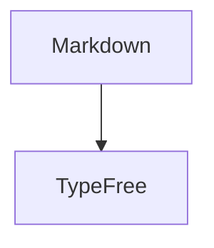

# TypeFree

[中文](./README.md) | [English](./README.en.md) | 日本語

<p align="center">
  
</p>

<p align="center">
  <strong>Open. Free. Yours.</strong>
</p>

TypeFree は、オープンで自由なローカルファースト Markdown エディタです。純粋な Markdown を唯一の情報源として保ちながら、WYSIWYG に近いブロック単位の編集体験を提供します。段落、見出し、引用、コード、数式、図表をレンダリングされた文書のように編集し、必要なときはいつでも全文ソースへ戻れます。

TypeFree は Markdown を隠そうとしません。文書はローカルファイルのまま、形式は透明なまま、標準的な Markdown ツールでも読み続けられます。エディタは、Markdown をより自然に、余計なノイズを減らして書けるようにするためのものです。

## 設計思想

- **Open**: ソースコードも文書形式も開かれており、ファイルを専用データベースに閉じ込めません。
- **Free**: クラウドアカウントに依存せず、自由な執筆、変更、配布を前提にしています。
- **Yours**: Markdown はあなたのローカルファイルです。TypeFree はそれを快適に編集するための道具です。

## 主な機能

- **ブロック単位の WYSIWYG 編集**: 任意の Markdown ブロックをクリックして対応するソースを編集し、フォーカスを外すとレンダリング表示へ戻ります。
- **全文ソースモード**: 完全な Markdown ソースへ切り替え、WYSIWYG とソースモード間で編集位置を保ちます。
- **ローカルファイルワークフロー**: 新規作成、開く、保存、名前を付けて保存、リネーム、終了前の未保存確認に対応します。
- **デスクトップ体験**: Tauri により、システムメニュー、最近使ったファイル、ネイティブファイルダイアログ、終了確認、アプリアイコンを提供します。
- **数式**: インラインおよびブロック LaTeX 数式のプレビュー。
- **Mermaid 図表**: Mermaid コードブロックのプレビュー。ライト/ダークテーマに追従します。
- **コードブロック**: シンタックスハイライト、行番号、言語表示、フェンス言語補完。
- **編集補助**: 括弧、引用符、Markdown 記号の自動ペアリング、選択範囲のラップ、ペア削除、IME 変換中の保護。
- **多言語 UI**: 中国語、英語、日本語のインターフェース文言。
- **テーマと設定**: ライト、ダーク、システム追従、Enter 動作、段落切り替えアニメーション。

## 向いているユーザー

TypeFree は、Markdown の透明性を保ちたい一方で、生のテキストノイズをずっと見続けたくないユーザー向けです。

- 技術メモ、開発ドキュメント、README、ブログ下書き。
- コードブロック、数式、Mermaid 図表を含む文書。
- ローカルファイル、移植しやすい形式、オープンなツールチェーンを好むワークフロー。
- Typora に近い体験を求めつつ、より軽く、開かれていて、変更しやすいエディタを求める場合。

## 技術スタック

- **React**: エディタ UI とインタラクション状態。
- **Vite**: Web ビルドと開発サーバー。
- **Tauri**: デスクトップウィンドウ、システムメニュー、ローカルファイル機能、macOS パッケージング。
- **marked**: Markdown 解析とレンダリング拡張。
- **highlight.js**: コードハイライト。
- **Mermaid**: 図表レンダリング。
- **KaTeX**: LaTeX 数式レンダリング。
- **pnpm workspace**: ルートスクリプトとフロントエンドパッケージ管理。

## クイックスタート

### 必要環境

- Node.js 18 以上。
- pnpm。
- Rust stable toolchain。
- macOS デスクトップパッケージングには Xcode Command Line Tools が必要です。

### 依存関係のインストール

```bash
pnpm install
```

リポジトリルートが `pnpm workspace` の入口であり、`frontend/` 配下の Web と Tauri フロントエンド依存関係をインストールします。

### Web 開発モード

```bash
pnpm run dev
```

既定の URL：

```text
http://localhost:5173
```

### デスクトップ開発モード

```bash
pnpm run dev:desktop
```

このコマンドは Tauri 経由で Vite 開発サーバーを起動し、デスクトップウィンドウを開きます。

### Web ビルド

```bash
pnpm run build
```

ビルド成果物：

```text
frontend/dist/
```

### デスクトップパッケージ

```bash
pnpm run dist:desktop
```

Tauri の成果物は次の場所に出力されます。

```text
frontend/src-tauri/target/release/bundle/
```

現在の macOS 設定では `.app` と `.dmg` を生成します。

## スクリプト

| Command | 説明 |
| --- | --- |
| `pnpm run dev` | リポジトリルートから Web 開発サーバーを起動 |
| `pnpm run dev:web` | Web 開発モードを明示して起動 |
| `pnpm run dev:desktop` | Tauri デスクトップ開発モードを起動 |
| `pnpm run build` | Web 版をビルド |
| `pnpm run build:web` | Web ビルドを明示して実行 |
| `pnpm run typecheck` | 型チェックを実行 |
| `pnpm run dist:desktop` | デスクトップアプリをビルド・パッケージ化 |
| `pnpm run preview` | Web ビルド成果物をプレビュー |

## 使い方

### WYSIWYG とソースモード

TypeFree は既定でブロック単位の WYSIWYG モードで文書を開きます。各 Markdown ブロックは通常時にプレビュー表示され、クリックすると対応するソース編集レイヤーに切り替わります。ツールバーまたはデスクトップメニューから全文ソースモードへ切り替えられます。

### ファイルのオープンと保存

ブラウザ環境では File System Access API を優先し、利用できない場合はファイル選択とダウンロード方式へフォールバックします。デスクトップ版では Tauri がネイティブの開く、保存、名前を付けて保存、リネーム、終了確認を提供します。

### Enter 動作

TypeFree は 2 つの Enter モードを提供します。

- `Paragraph`: Enter で新しい段落を作り、`Shift + Enter` で改行を挿入します。
- `Newline`: Enter で改行を挿入し、`Shift + Enter` で新しい段落を作ります。

### 数式と図表

インライン数式は `$...$`、ブロック数式は `$$...$$` を使用します。Mermaid 図表は標準のフェンスコードブロックで記述します。

````markdown

````

### コードブロック

コードブロックは標準 Markdown フェンスを使います。フェンス言語の入力時には候補を表示でき、プレビューではシンタックスハイライトと行番号をサポートします。

````markdown
```typescript
const message = 'Open. Free. Yours.';
```
````

## カスタムフォント

TypeFree は既定で Google Sans フォントスタックを使用します。カスタムフォントの入口は次のファイルです。

```text
frontend/public/fonts/custom-fonts.css
```

アプリにフォントを同梱する場合：

1. フォントファイルを `frontend/public/fonts/` に配置します。
2. `custom-fonts.css` で対応する `@font-face` を有効化または追加します。
3. `--typefree-custom-font-sans` を対象フォントファミリーへ向けます。

同梱フォントがない場合、アプリはローカルの `Google Sans`、`Product Sans`、システム sans-serif の順に試します。

## プロジェクト構成

```text
.
├── README.md
├── README.en.md
├── README.ja.md
├── docs/
│   └── assets/
├── frontend/
│   ├── App.tsx
│   ├── components/
│   ├── public/
│   ├── src-tauri/
│   ├── tauriDesktop.ts
│   ├── i18n.ts
│   ├── index.html
│   ├── index.tsx
│   ├── types.ts
│   └── utils.ts
└── package.json
```

主要パス：

| Path | 説明 |
| --- | --- |
| `frontend/App.tsx` | エディタの主要状態、モード切替、ファイル操作、設定 |
| `frontend/components/Block.tsx` | ブロック編集、レンダリング切替、入力補助、数式/図表入口 |
| `frontend/components/MathPreview.tsx` | 数式プレビュー |
| `frontend/components/MermaidPreview.tsx` | Mermaid 図表プレビュー |
| `frontend/src-tauri/` | Tauri/Rust デスクトップシェル、ネイティブメニュー、ファイル IO、パッケージ設定 |
| `frontend/tauriDesktop.ts` | フロントエンドと Tauri コマンド/イベントの互換ブリッジ |
| `frontend/i18n.ts` | 多言語 UI 文言 |
| `frontend/utils.ts` | Markdown ブロック分割、カーソルマッピング、シンタックスハイライト、レンダリング補助 |

## 開発状況

TypeFree はまだ高速に改善中です。現在は Markdown 編集体験の安定化、デスクトップファイルワークフローの改善、より明確なエディタアーキテクチャの整理に注力しています。

貢献しやすい領域：

- エディタ操作と IME 互換性。
- Markdown レンダリングの正確性とカーソルマッピング。
- デスクトップファイルワークフロー。
- テーマ、フォント、アクセシビリティ。
- ドキュメント、例、テストカバレッジ。

## ライセンス

このリポジトリにはまだ LICENSE ファイルがありません。正式な再利用、再配布、コントリビューションの前に、明確なオープンソースライセンスを追加してください。
