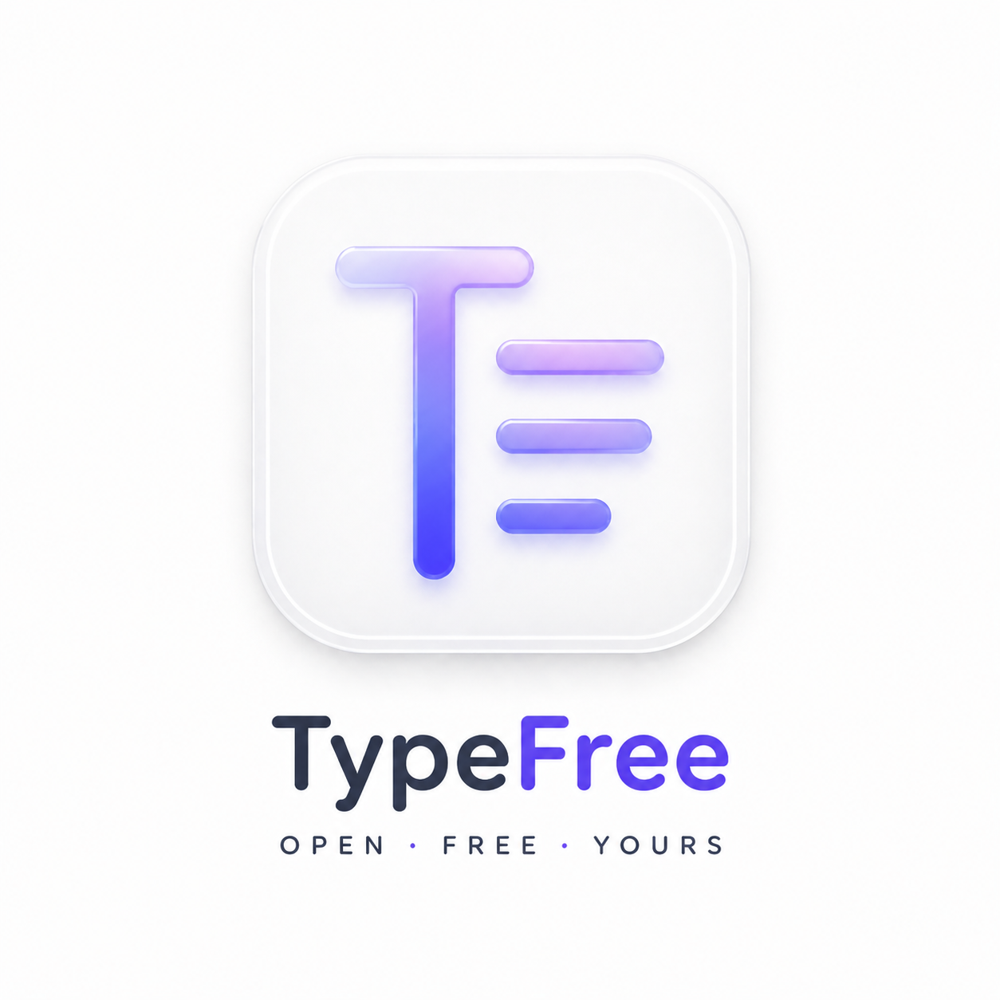
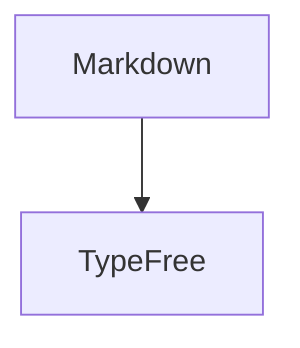

# TypeFree

<p align="center">
  
</p>

<p align="center">
  <strong>Open. Free. Yours.</strong>
</p>

TypeFree 是一个开源、自由、本地优先的 Markdown 编辑器。它以纯 Markdown 作为唯一内容源，同时提供接近所见即所得的块级编辑体验：写作时可以专注在段落、标题、引用、代码、公式和图表本身，需要时也可以随时切换到完整源码模式。

TypeFree 的目标不是把 Markdown 藏起来，而是让 Markdown 更自然地被编辑。文档仍然属于你，格式仍然透明，文件仍然可以被任何标准 Markdown 工具读取。

## 项目理念

- **Open**: 项目代码开放，编辑格式开放，文档不被锁进私有数据库。
- **Free**: 面向自由写作、自由修改、自由分发而设计，不依赖云端账户。
- **Yours**: Markdown 是你的本地文件，TypeFree 只是帮助你更舒服地编辑它。

## 核心特点

- **块级 WYSIWYG 编辑**: 点击任意段落即可编辑对应 Markdown，失焦后回到渲染视图。
- **源码模式**: 一键切换到完整 Markdown 源码编辑，并在 WYSIWYG 与源码模式之间保持光标位置同步。
- **本地文件工作流**: 支持新建、打开、保存、另存为、重命名文件，以及关闭前未保存提醒。
- **桌面端体验**: 基于 Tauri，支持系统菜单、最近文件、原生文件对话框、关闭前保存确认和应用图标。
- **数学公式**: 支持行内公式和块级 LaTeX 数学预览。
- **Mermaid 图表**: 支持 Mermaid 图表块的实时预览，并跟随亮色/暗色主题。
- **代码块体验**: 支持代码高亮、行号、语言标识和代码围栏语言补全。
- **编辑辅助**: 支持括号/引号/Markdown 标记自动配对、选区包裹、成对删除和输入法组合态保护。
- **多语言界面**: 内置中文、英文、日文界面文案。
- **主题与偏好**: 支持浅色、深色、跟随系统、回车行为和段落切换动画设置。
- **自定义字体**: 默认使用 Google Sans 字体栈，并保留本地字体文件接入点。

## 适合谁

TypeFree 适合希望保留 Markdown 透明性，同时又不想长期面对纯文本噪音的用户：

- 写技术笔记、开发文档、README、博客草稿。
- 编写包含代码块、数学公式或 Mermaid 图表的文档。
- 偏好本地文件、可迁移格式和开源工具链。
- 想要 Typora 类体验，但希望项目更轻、更开放、更可改。

## 技术栈

- **React**: 编辑器界面与交互状态。
- **Vite**: Web 构建和开发服务器。
- **Tauri**: 桌面应用、系统菜单、本地文件能力和 macOS 打包。
- **marked**: Markdown 解析与渲染扩展。
- **highlight.js**: 代码高亮。
- **Mermaid**: 图表渲染。
- **KaTeX**: LaTeX 数学公式渲染。
- **Tailwind CDN**: 当前 UI 原型阶段的样式工具。
- **pnpm**: 项目脚本和依赖管理。

## 快速开始

### 环境要求

- Node.js 18 或更高版本。
- pnpm。
- Rust stable toolchain。
- macOS 桌面打包需要 Xcode Command Line Tools。

### 安装依赖

```bash
pnpm install
```

仓库根目录现在是正式的 `pnpm workspace` 入口。上面的命令会一次性安装 `frontend/` 里的全部 Web 和 Tauri 前端依赖。

如果你只想在 `frontend/` 目录单独执行命令，也可以运行：

```bash
pnpm --dir frontend install
```

### 启动 Web 开发模式

```bash
pnpm run dev
```

这个根目录命令会转发到 `frontend/` 中真实的 Vite 应用包。

默认访问地址：

```text
http://localhost:5173
```

### 启动桌面开发模式

```bash
pnpm run dev:desktop
```

该命令会通过 Tauri 启动 Vite 开发服务器，并打开桌面端窗口。

### 构建 Web 版本

```bash
pnpm run build
```

构建产物位于：

```text
frontend/dist/
```

### 打包桌面应用

```bash
pnpm run dist:desktop
```

桌面打包由 Tauri 处理，产物输出到：

```text
frontend/src-tauri/target/release/bundle/
```

当前 macOS 配置会生成 `.app` 和 `.dmg` 目标。

## 常用脚本

| 命令 | 说明 |
| --- | --- |
| `pnpm run dev` | 从仓库根目录启动 Web 开发服务器 |
| `pnpm run dev:web` | 从仓库根目录启动 Web 开发服务器 |
| `pnpm run dev:desktop` | 从仓库根目录启动 Tauri 桌面开发模式 |
| `pnpm run build` | 从仓库根目录构建 Web 版本 |
| `pnpm run build:web` | 从仓库根目录构建 Web 版本 |
| `pnpm run dist:desktop` | 从仓库根目录构建并打包桌面应用 |
| `pnpm run preview` | 从仓库根目录预览 Web 构建产物 |

## 使用说明

### WYSIWYG 与源码模式

TypeFree 默认以块级 WYSIWYG 模式打开文档。每个 Markdown 块会在普通状态下渲染为预览内容，点击后切换为对应源码编辑层。顶部工具栏或桌面菜单可以切换到源码模式，源码模式会显示完整 Markdown 文本。

### 文件打开与保存

在浏览器环境中，TypeFree 会优先使用 File System Access API；不支持该 API 时会回退到文件选择和下载方式。在桌面端中，Tauri 会使用系统原生打开、保存、另存为、重命名和关闭确认能力。

### 回车行为

TypeFree 提供两种回车模式：

- `Paragraph`: 回车创建新段落，`Shift + Enter` 插入换行。
- `Newline`: 回车插入换行，`Shift + Enter` 创建新段落。

### 公式与图表

行内数学公式使用 `$...$`，块级数学公式使用 `$$...$$`。Mermaid 图表使用标准代码围栏：

````markdown

````

### 代码块

代码块使用标准 Markdown 围栏。输入代码围栏语言时，编辑器会显示语言建议；代码预览支持语法高亮和行号。

````markdown
```typescript
const message = 'Open. Free. Yours.';
```
````

## 自定义字体

TypeFree 默认使用 Google Sans 字体栈。自定义字体入口位于：

```text
frontend/public/fonts/custom-fonts.css
```

如需随应用打包字体文件：

1. 将字体文件放入 `frontend/public/fonts/`。
2. 在 `custom-fonts.css` 中启用或新增对应的 `@font-face`。
3. 修改 `--typefree-custom-font-sans` 指向你的字体族名。

如果没有配置随包字体，应用会依次尝试本机 `Google Sans`、`Product Sans` 和系统 sans-serif 字体。

## 应用图标与品牌资源

- README 展示图: `docs/assets/typefree-open-free-yours.png`
- Web favicon 与运行时图标: `frontend/public/app-icon.png`
- Tauri 打包图标: `frontend/build/icon.png`、`frontend/build/icon.icns`

## 项目结构

```text
.
├── README.md
├── docs/
│   └── assets/
├── frontend/
│   ├── App.tsx
│   ├── components/
│   ├── public/
│   ├── src-tauri/
│   ├── tauriDesktop.ts
│   ├── i18n.ts
│   ├── index.html
│   ├── index.tsx
│   ├── types.ts
│   ├── utils.ts
│   └── vite.config.ts
└── package.json
```

主要目录说明：

| 路径 | 说明 |
| --- | --- |
| `frontend/App.tsx` | 编辑器主状态、模式切换、文件操作和设置面板 |
| `frontend/components/Block.tsx` | 块级编辑、渲染切换、输入辅助和公式/图表入口 |
| `frontend/components/MathPreview.tsx` | 数学公式预览 |
| `frontend/components/MermaidPreview.tsx` | Mermaid 图表预览 |
| `frontend/src-tauri/` | Tauri/Rust 桌面壳、原生菜单、文件读写和打包配置 |
| `frontend/tauriDesktop.ts` | 前端到 Tauri 命令和事件的兼容桥接 |
| `frontend/i18n.ts` | Web 界面多语言文案 |
| `frontend/utils.ts` | Markdown 分块、光标映射、语法高亮和渲染辅助 |

## 开发状态

TypeFree 仍处于快速迭代阶段。当前重点是稳定 Markdown 编辑体验、完善桌面端工作流，并逐步沉淀更清晰的编辑器架构。

欢迎围绕这些方向参与：

- 编辑器交互与输入法兼容性。
- Markdown 渲染准确性和光标映射。
- 桌面端文件工作流。
- 主题、字体和可访问性。
- 文档、示例和测试覆盖。

## License

当前仓库尚未包含 LICENSE 文件。正式复用、分发或贡献前，请先补充明确的开源许可证。
